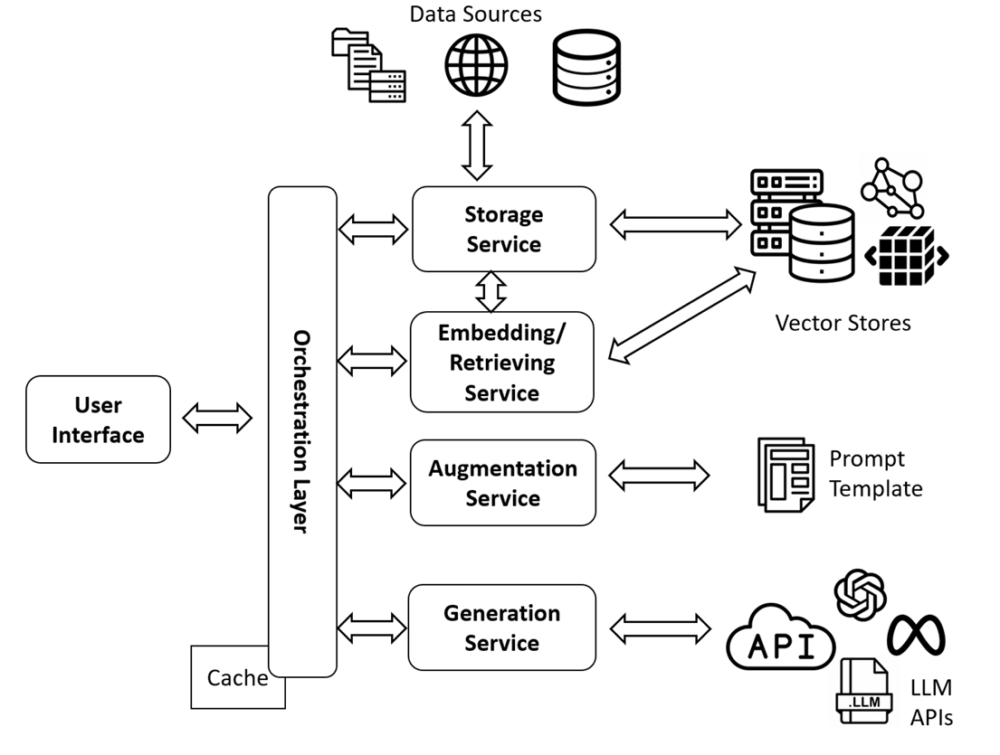

# rag-refactor - Interactive AI guided code refactoring using RAG (Retrieval Augmented Generation)

Automating move method refactoring through Retrieval Augmented Generation (RAG), leveraging codebase call graphs for indexing, and searching pertinent code chunks.
Augmentation of prompts with codeflow and details converted to natural language to improve LLM recall and context faithfulness.

Applying my learnings on:

- Retrival Augmented Refactoring
- LargeLanguage Models
- CodeQL (extraction of call and data flow patterns from code)
- ChromaDB (vector databse to embed code chunks against logical embedding vector for quick retrieval)
- LangChain (Pipeline for Userinput --> prompt improvement --> RAG --> LLM Integration --> Validation)
- Application of LLMs to Knowlwdge Intensive and Domain Specific Tasks

Key Steps and framework components:

- Effective code chunking, Abstraction and indexing.
- Call graph generation for the Entities in focus and branch outs.
- Quick Similarity and Structural Search to identify required snippets.
- Augmentation template types and retrieved information (benchmarking.)
- Output guidelines and format types experimentation.
- Parsing outputs in standard formats (ex:Json) for communication between flows.
- Benchmarking and % refactoring effort reduction, % complexity reduction.
- Addition retrival and generation accuracy metrics,
